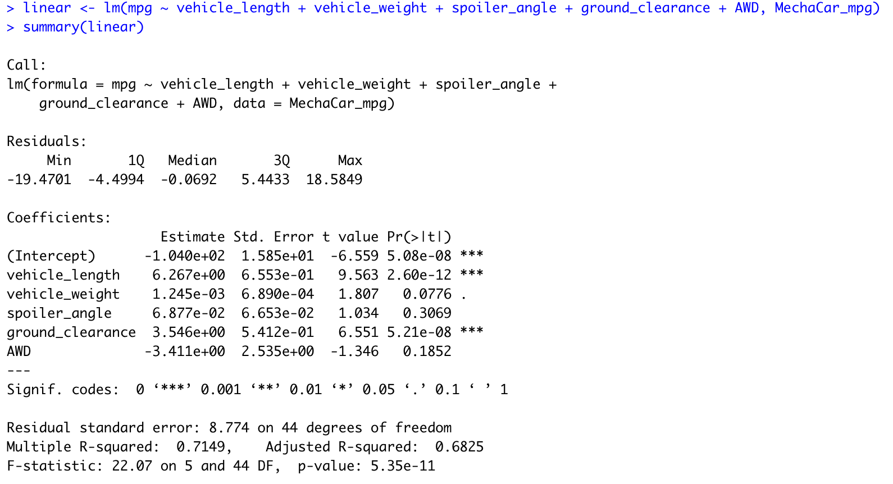
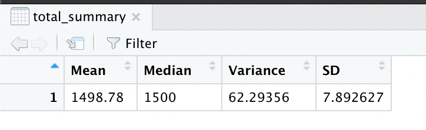
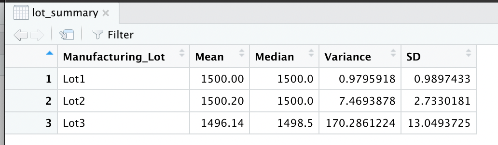

# MechaCar_Statistical_Analysis
Source Code: [MechaCarChallenge.RScript](MechaCarChallenge.R)

## Overview
The goal of the project is to analyze metrics that can affect the manufacturing a new car prototype and compare vehicle performance across different manufacturer lots. These metrics include vehicle length, weight, spoiler angle, ground clearance, AWD capabilities, MPG, and PSI.

## Linear Regression to Predict MPG

Analysis:

- Vehicle Length and Ground Clearance provide a non-random amount of variance to the mpg values.

- We are able to reject the null hypothesis because of the extremely small p-value.

- With R-squared value of 0.7149, we will able to predict mpg effectively(~71%)

## Summary Statistics on Suspension Coils

- The suspension coil’s PSI continuous variable across all manufacturing lots
- The following PSI metrics for each lot: mean, median, variance, and standard deviation.

## T-Test on Suspension Coils
### Summary t-test results across the Manufactoring Lots:

### Summary t-test results for individual Manufactoring Lots:

### Summary fo Individual T-Tests:
Lot 1 and 2 have p-value greater than 0.05 therefore we can fail to reject the null hypothesis that each lot individually are statistically different from the population mean of 1,500 PSI, However in lot 3 the p-value is less than 0.05 so we can reject the null hypothesis.

## Study Design: MechaCar vs. Competition
We could to study on MechaCar's standing against its competition is a linear regression on city and highway MPG.

The metrics that can be included in this analysis are:

- City and highway fuel efficiency: dependent variable
- MPG: independent variable
- Horse power: independent variable
- AWD capabilities: independent variable
- Vehicle weight: independent variable

Hypothesis: Null and Alternative

- Null Hypothesis: MechaCar is priced correctly based on its performance of key factors for its genre.

- Alternative Hypothesis: MechaCar is NOT priced correctly based on performance of key factors for its genre.

Statistical test used to test the hypothesis: T-Test

Data for Statistical Test: Fuel Effencicy Data(MPG Data)
